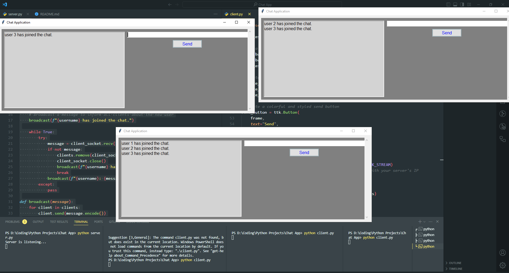
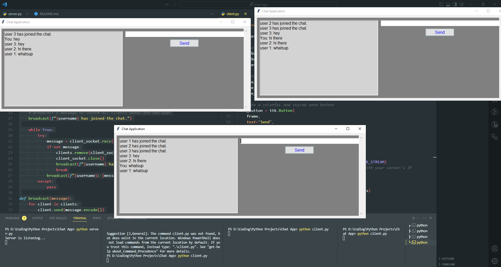

# Chat Application

The Chat Application is a simple Python-based chat client that allows users to connect to a chat server and engage in real-time messaging. This application is designed with a graphical user interface (GUI) using the Tkinter library, making it user-friendly and accessible.
---

---


## Demo

<video src="Demo.mp4" controls title="Chat Application"></video>

## Features

- Real-time chat: Multiple users can join a chat room and send messages instantly.
- User-friendly GUI: The application provides a simple and intuitive interface for sending and receiving messages.
- Easy-to-use: Users can send messages by hitting "Enter" or clicking the "Send" button.

## Prerequisites

- Python 3.12 installed on your system.
- A chat server running (see the [Server Setup](#server-setup) section).

## Getting Started

1. **Clone the Repository**:

    ```
    git clone https://github.com/raj007-star/chat-application.git

    cd Chat Application
    ```


2. **Server Setup**:

- Before running the client, make sure you have a chat server set up.
- You can use the provided server code as a starting point. To run the server, follow these steps:
  - Open a terminal and navigate to the project directory.
  - Run the server script:

    ```bash
    python server.py
    ```

3. **Run the Chat Client**:

- Open a new terminal for each client you want to run.
- Navigate to the project directory.
    - Run the client script:

        ```bash
        python client.py
        ```

4. **Use the Chat Application**:

- You can now send and receive messages with other connected multiple clients in real time.

## Customization

- You can customize the appearance of the chat client's GUI by modifying the code in the client script.
- Experiment with colors, fonts, and styles to create the look you prefer.

## Authors

#### [Swarnava Gayen](https://github.com/raj007-star)

## License

This project is licensed under the MIT License. See the [LICENSE](LICENSE) file for details.

## Acknowledgments

This project was created during an internship at CodesOnBytes.

*Thanks to CodesOnBytes for the internship opportunity.*